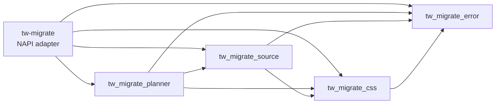

# RFC: Rust Workspace Restructure

## Status

Proposed

## Summary

The native planner currently lives in one unpublished Rust crate. Its `src/` directory contains 18,006 lines across flat modules, and `planner.rs` alone contains 7,336 lines. About 2,700 lines in `planner.rs` implement request parsing, batch coordination, source-map handling, Vue rewriting, edit validation, and response construction. Most of the remaining lines are planner tests.

This RFC splits the native implementation into capability-oriented workspace crates and divides large implementation and test modules by concern. The existing `tw-migrate` crate remains the only NAPI addon and the only externally supported native boundary.

The target workspace contains five unpublished crates:

- `tw_migrate_error` owns typed migration errors and recoverability.
- `tw_migrate_css` owns stylesheet parsing, CSS planning, utility generation, media handling, and stylesheet analysis.
- `tw_migrate_source` owns JavaScript, JSX, HTML, and Vue-consumer analysis and rewrite planning.
- `tw_migrate_planner` owns batch orchestration, planner request and response models, Vue stylesheet finishing, source-map resolution, and final edit validation.
- `tw-migrate` exposes the existing NAPI functions and translates native errors for JavaScript callers.

The restructure preserves every NAPI export, JSON shape, warning code, error message, candidate, edit, and migration safety invariant. Internal API changes are allowed when they establish the new dependency boundaries. New migration behavior, syntax support, and performance work remain separate.

## Goals

1. Replace the flat native source layout with capability-oriented workspace crates.
2. Make dependency direction explicit and acyclic through Cargo boundaries.
3. Reduce `planner.rs` into focused planner modules.
4. Split production files that exceed 1,000 lines when they contain separable concerns.
5. Split large test modules by behavior while retaining access to private crate implementation.
6. Replace string-prefix error classification with a shared typed error model.
7. Keep the existing `tw-migrate` package and NAPI contract unchanged.
8. Keep every implementation commit buildable and testable.

## Non-Goals

1. Changing Tailwind candidate generation, selector proofs, source rewriting, or retention policy.
2. Adding support for new CSS, JavaScript, HTML, Vue, Sass, SCSS, or Less syntax.
3. Restructuring the TypeScript sources, Node tests, snapshot harness, or ecosystem harness.
4. Publishing any Rust crate as a supported public library.
5. Creating one crate per file or per parser module.
6. Adding a general-purpose `shared`, `common`, or `model` crate.
7. Optimizing compile time without measurements.
8. Changing the root JavaScript package or platform-specific `npm/*` packages.

## Current Problems

### Planner ownership is too broad

`planner.rs` owns unrelated responsibilities:

- request and response serialization;
- shared source, HTML, warning, and edit records;
- batch ordering and conflict detection;
- CSS request preparation;
- source-map lookup and authored-span resolution;
- Vue masking, rebasing, block removal, and final validation;
- edit application and empty-conditional cleanup;
- most end-to-end Rust planner tests.

The file therefore acts as an orchestrator, data model, utility module, and test suite at the same time.

### Lower modules depend on planner-owned types

`js_rewrite.rs` and `html_rewrite.rs` import `Edit`, `SourceFile`, `Warning`, HTML records, and offset helpers from `planner.rs`. The planner imports those rewrite modules in return. Rust permits this within one crate, but the ownership direction prevents a clean crate extraction.

Two other imports reveal misplaced domain ownership:

- `css_plan.rs` imports selector relationship vocabulary from `jsx_graph.rs` even though CSS parsing creates the proof obligations.
- `media.rs` imports `StylesheetSyntax` from `planner.rs` even though syntax belongs to the stylesheet domain.

The restructure moves each type to the lowest capability that owns its meaning.

### String errors encode control flow

`is_recoverable_input_error()` classifies errors by matching rendered message prefixes such as `Failed to parse`, `Failed to analyze`, and `Unsupported source file`. A wording change can therefore alter `--force` behavior. The crate split would spread this implicit contract across more modules.

### File size hides internal seams

Several production modules exceed or approach 1,000 lines:

| File            | Total lines | Primary concern seams                                     |
| --------------- | ----------: | --------------------------------------------------------- |
| `planner.rs`    |       7,336 | orchestration, models, Vue, source maps, edits, tests     |
| `jsx_graph.rs`  |       2,088 | collection, intermediate graph, linking, proof, tests     |
| `media.rs`      |       1,789 | condition parsing, collection API, generated names, tests |
| `js_rewrite.rs` |       1,170 | imports, usage collection, expression rewrite, validation |
| `css_plan.rs`   |       1,031 | selector planning, declaration planning, shadow indexing  |

Line count does not determine crate boundaries. It serves as a module review trigger after capability boundaries are established.

## Design Principles

### Capability crates, folder modules

Cargo crates enforce stable dependency boundaries. Folder modules divide implementation details inside those boundaries. A concern becomes a crate only when it has a narrow internal API and a one-way dependency relationship with its consumers.

`media`, `utilities`, `jsx_graph`, and similar concerns remain modules because the project has no independent reuse, ownership, or compilation requirement for them.

### Lowest capable owner

A shared type belongs to the lowest crate that can define it without depending on its consumers. Examples include:

- stylesheet syntax and selector relationship requirements belong to `tw_migrate_css`;
- source files, HTML records, source edits, and source diagnostics belong to `tw_migrate_source`;
- batch requests, aggregate responses, and planner reports belong to `tw_migrate_planner`;
- migration failures and recoverability belong to `tw_migrate_error`.

This rule avoids a miscellaneous shared crate.

### Internal APIs only

Every new crate uses `publish = false`. Its public Rust items form workspace contracts, not supported external APIs. The implementation exposes only the items required by direct dependents.

The existing NAPI and TypeScript APIs remain the compatibility boundary.

## Physical Workspace Layout

Every Rust crate is a sibling directly below the workspace `crates/` directory, matching the Vite+ repository layout. No crate is nested inside `crates/tw_migrate/`.

```text
crates/
├── tw_migrate/
├── tw_migrate_error/
├── tw_migrate_css/
├── tw_migrate_source/
├── tw_migrate_planner/
└── snapshots/
```

The workspace keeps `members = ["crates/*"]`, so adding these sibling directories requires no nested workspace configuration. It explicitly includes every product crate in `default-members` while continuing to exclude the artifact-dependent snapshot crate:

```toml
default-members = [
  "crates/tw_migrate",
  "crates/tw_migrate_error",
  "crates/tw_migrate_css",
  "crates/tw_migrate_source",
  "crates/tw_migrate_planner",
]
```

This makes the bare `cargo test` invoked by `vp run test` execute each product crate's unit tests without selecting `crates/snapshots`.

## Target Dependency Graph

The flat directory layout does not flatten Cargo dependencies. Each crate depends only on the lower-level capabilities it consumes. Every arrow points from the dependent crate to its direct dependency.



The exact Cargo dependencies are:

- `tw_migrate_error` depends only on the Rust standard library unless an existing workspace dependency is required to preserve an owned error value.
- `tw_migrate_css` depends on `tw_migrate_error` and CSS parser dependencies.
- `tw_migrate_source` depends on `tw_migrate_error`, `tw_migrate_css`, and Oxc source parser dependencies.
- `tw_migrate_planner` depends on `tw_migrate_error`, `tw_migrate_css`, and `tw_migrate_source`.
- `tw-migrate` depends directly on every crate that owns one of its NAPI operations.

The graph must satisfy these prohibitions:

- CSS cannot depend on source or planner.
- Source cannot depend on planner.
- Planner implementation cannot move back into the NAPI crate.
- No crate may depend on `tw-migrate`.

## Crate Responsibilities

### `tw_migrate_error`

This crate owns a detailed `MigrationError` enum. Variants represent domain failures rather than rendered string categories. Initial categories include:

- invalid planner requests and serialization failures;
- authored and edited stylesheet parse failures;
- JavaScript or TypeScript parse and semantic-analysis failures;
- unsupported source types;
- source-map decoding and authored-span resolution failures;
- invalid or overlapping edits;
- plan collisions and output validation failures;
- internal invariant failures currently returned as fatal strings.

Each variant owns only portable data such as paths, spans, and rendered parser diagnostics. Oxc and CSS parser AST or diagnostic types do not cross into the error crate.

`MigrationError::is_recoverable()` replaces string-prefix classification. Recoverability must match current behavior:

- package input parse and analysis failures remain recoverable;
- unsupported source files remain recoverable;
- edited-output parse failures remain fatal;
- integrity, collision, and write-safety failures remain fatal.

`Display` preserves the current user-visible message for every migrated error path. The NAPI crate adds `TW_MIGRATE_RECOVERABLE_INPUT:` only for errors returned by `collectMediaConditions` and `planBatchMigration`, matching the current endpoint-specific behavior. Other NAPI exports return the displayed message without the prefix even when the same error variant is recoverable in a planning context.

### `tw_migrate_css`

This crate owns:

- `StylesheetSyntax` and parser selection;
- arbitrary value encoding and theme matching;
- declaration-to-utility conversion and utility conflict checks;
- at-rule, animation, keyframe, and media-query handling;
- CSS rule and selector planning;
- shadow selector indexing;
- stylesheet dependency and directive analysis;
- media condition collection and probe-key generation;
- CSS validation used directly by NAPI.

The CSS selector model owns the relationship vocabulary needed to describe JSX proof obligations. `tw_migrate_source` consumes those obligations and returns proof results. CSS planning no longer imports a type from the JSX graph.

Suggested internal layout:

```text
crates/tw_migrate_css/src/
├── lib.rs
├── syntax.rs
├── plan/
│   ├── mod.rs
│   ├── rules.rs
│   ├── selectors.rs
│   └── shadow.rs
├── values/
│   ├── mod.rs
│   ├── arbitrary.rs
│   ├── theme.rs
│   └── utilities.rs
├── at_rules/
│   ├── mod.rs
│   └── animations.rs
├── media/
│   ├── mod.rs
│   └── collect.rs
└── analysis/
    ├── mod.rs
    ├── directives.rs
    └── stylesheet.rs
```

The implementation may combine files that remain cohesive and below the soft limit. The directory names express ownership, not a required one-to-one move map.

### `tw_migrate_source`

This crate owns:

- source file, module binding, HTML element, attribute, and stylesheet-link records;
- byte-span edits and offset rebasing used by source planners;
- JavaScript and JSX source-type selection and validation;
- CSS Module import and usage rewriting;
- JSX relationship graph preparation and proof;
- HTML class and ID rewriting;
- Vue template consumer rewriting;
- source analysis used directly by NAPI;
- source-level warnings produced while planning edits.

The planner may consume these types, but source code cannot import planner requests or responses.

Suggested internal layout:

```text
crates/tw_migrate_source/src/
├── lib.rs
├── model/
│   ├── mod.rs
│   ├── edit.rs
│   ├── html.rs
│   └── source_file.rs
├── analysis/
│   ├── mod.rs
│   └── source.rs
├── rewrite/
│   ├── mod.rs
│   ├── html.rs
│   └── js/
│       ├── mod.rs
│       ├── imports.rs
│       └── usage.rs
└── jsx/
    ├── mod.rs
    ├── collect.rs
    ├── graph.rs
    ├── link.rs
    └── prove.rs
```

The JSX graph split must follow its existing passes. It must not introduce traits or abstractions solely to keep files below the soft line limit.

### `tw_migrate_planner`

This crate owns:

- single and batch planner request deserialization;
- aggregate planner response serialization;
- batch conflict detection and candidate ordering;
- per-stylesheet request preparation and planning coordination;
- source consumer dispatch;
- source-map decoding for `decodeSourceMap` and authored rule-span mapping;
- Vue style-block masking, rebasing, removal, and validation;
- final stylesheet edit application and conditional cleanup;
- recoverable versus fatal planner result propagation.

Suggested internal layout:

```text
crates/tw_migrate_planner/src/
├── lib.rs
├── request.rs
├── response.rs
├── batch.rs
├── consumer.rs
├── stylesheet.rs
├── source_map.rs
├── edit.rs
└── vue.rs
```

`lib.rs` exposes the narrow JSON planning entrypoint used by NAPI and test-only compatibility helpers where existing unit tests require them.

### `tw-migrate`

The existing crate remains at `crates/tw_migrate`. It retains `crate-type = ["cdylib", "rlib"]` and owns:

- NAPI annotations and JavaScript-facing function names;
- conversion from `MigrationError` to `napi::Error`;
- the recoverable input prefix for `collectMediaConditions` and `planBatchMigration` only;
- dispatch to CSS, source, and planner operations.

It contains no CSS, source-rewrite, or planning implementation.

The existing exports remain unchanged:

- `decodeSourceMap`;
- `validateCss`;
- `expressionAnalysis`;
- `sourceAnalysis`;
- `stylesheetAnalysis`;
- `collectCssDirectives`;
- `mediaProbeKey`;
- `collectMediaConditions`;
- `planBatchMigration`.

`decodeSourceMap` dispatches to the source-map API owned by `tw_migrate_planner`; the NAPI crate does not parse or serialize source maps.

## File Size and Module Policy

Production files use 1,000 lines as a soft review limit. A file over the limit must either split along an existing pass or responsibility boundary, or document why a split would reduce cohesion.

The limit does not apply mechanically to generated code, fixtures, or test data. Tests should still split when a single module covers unrelated planner behavior.

A module split must not introduce:

- one-implementation traits;
- factories for fixed construction paths;
- forwarding layers without ownership value;
- duplicate models created only to avoid a direct dependency;
- re-export trees that hide dependency direction.

## Test Layout

Tests stay inside their owning crates so they can exercise private implementation without widening Rust APIs.

Large test modules split by behavior. The planner test layout should follow the major planning surfaces, for example:

```text
crates/tw_migrate_planner/src/tests/
├── mod.rs
├── batch.rs
├── css_modules.rs
├── expressions.rs
├── media.rs
├── preprocessors.rs
├── source_maps.rs
└── vue.rs
```

`tests/mod.rs` may provide the existing JSON planning helper and small request builders. It must not grow into a second planner implementation.

Cross-crate behavior continues to use the existing Node tests and packaged CLI snapshots. Moving a Rust test to a new crate cannot weaken its assertions or convert byte-exact checks into broad snapshots.

## Implementation Sequence

The work lands as one pull request with buildable commits. Each commit performs one ownership move and passes the tests available at that point.

### Commit 1: Split planner tests

Move the large inline planner suite into concern-based child modules. Preserve test bodies and helper behavior.

Exit criteria: `cargo test` passes with no production change.

### Commit 2: Split planner modules

Create the planner folder layout inside the existing crate. Move requests, responses, batch coordination, Vue handling, source-map logic, and edits without changing behavior. Move shared records toward their eventual CSS or source owner within the existing crate namespace.

Exit criteria: `cargo test` passes and no implementation file exceeds the soft limit without a documented cohesion reason.

### Commit 3: Add typed errors

Create `tw_migrate_error`, add detailed domain variants, and replace string-prefix recoverability checks. Preserve rendered messages and the existing endpoint-specific NAPI prefix behavior.

Exit criteria: focused Rust and Node tests prove recoverable and fatal errors retain their previous messages and `--force` behavior.

### Commit 4: Extract CSS

Create `tw_migrate_css`, move stylesheet-owned modules, move stylesheet syntax and selector relationship vocabulary, and expose the minimum API required by source and planner.

Exit criteria: CSS cannot depend on source or planner, and CSS tests pass in the new crate.

### Commit 5: Extract source analysis and rewriting

Create `tw_migrate_source`, move source records, edit primitives, JS and HTML rewriting, JSX proof, and source analysis. Remove every source-to-planner import.

Exit criteria: source depends only on CSS and error among local crates, and source tests pass in the new crate.

### Commit 6: Extract planner and reduce NAPI

Create `tw_migrate_planner`, move orchestration and source-map decoding, and reduce `crates/tw_migrate/src/lib.rs` to NAPI dispatch and error conversion. Update workspace path dependencies and set `default-members` to all five product crates while excluding snapshots.

Exit criteria: the root native crate contains no planner implementation, bare `cargo test` executes every product crate's tests, and NAPI exports remain unchanged.

### Commit 7: Final dependency and documentation audit

Remove obsolete re-exports, narrow public visibility, update `AGENTS.md` and architecture references, and verify unused workspace dependencies with the existing cargo-shear check.

Exit criteria: the dependency graph matches this RFC and the full repository validation passes.

## Compatibility and Safety Invariants

The restructure must preserve these contracts:

- `--dry-run` never modifies the filesystem.
- Source changes during planning and writing remain fatal integrity errors.
- `--force` skips only recoverable package input failures.
- Plan collisions, invalid edits, and write failures remain fatal.
- Symlink migration targets remain rejected.
- Source permissions and transactional rollback remain unchanged.
- JS, JSX, TS, TSX, HTML, and Vue edits preserve untouched bytes.
- Sass and Less continue loading from the target project.
- Unsupported or ambiguous rewrites retain source with the same warnings.
- NAPI function names, JSON camelCase fields, error messages, and endpoint-specific recoverability prefixes remain byte-compatible.

No snapshot update is expected from this RFC. Any snapshot change requires a separately approved behavior change.

## Validation

Run focused crate tests after each extraction. Run the full repository checks before the RFC implementation is complete:

```bash
vp check
vp run test
vp run test:snapshots
```

The final validation must also confirm:

1. `cargo test -p tw_migrate_error` passes.
2. `cargo test -p tw_migrate_css` passes.
3. `cargo test -p tw_migrate_source` passes.
4. `cargo test -p tw_migrate_planner` passes.
5. `cargo test -p tw-migrate` passes.
6. Packaged snapshots produce no snapshot diff.
7. The generated native addon still resolves through `src/native.ts` and installed platform packages.

## Success Criteria

1. The Rust workspace contains the five crates defined by this RFC.
2. Cargo enforces the documented dependency direction without cycles.
3. The NAPI crate contains only adapter code.
4. No source or CSS crate imports planner-owned types.
5. Recoverability comes from `MigrationError` variants rather than rendered strings.
6. Planner, JSX graph, media, JS rewrite, and CSS plan code is organized by concern.
7. Production files respect the 1,000-line soft limit or retain a documented cohesion exception.
8. Rust tests are grouped with their owning capability.
9. `vp check`, `vp run test`, and `vp run test:snapshots` pass without behavior or snapshot changes.

## Accepted Trade-offs

1. One pull request will contain extensive file movement and Cargo changes. Buildable commits provide review and bisect boundaries.
2. Cross-crate types require more `pub` items than the single-crate layout. `publish = false` and narrow re-exports limit that surface.
3. A detailed shared error enum couples domain error additions to `tw_migrate_error`. The explicit recoverability contract is worth that coupling.
4. Some files may remain near the soft limit when a parser or graph pass has one cohesive state machine.

## Deferred Work

1. Publishing or documenting the Rust crates as external libraries.
2. Splitting media, utilities, JSX graph, or analysis into additional crates without a concrete reuse or ownership need.
3. TypeScript and ecosystem harness restructuring.
4. Compile-time optimization and feature-gated dependency reduction.
5. Planner behavior, migration coverage, and performance changes unrelated to the new boundaries.
